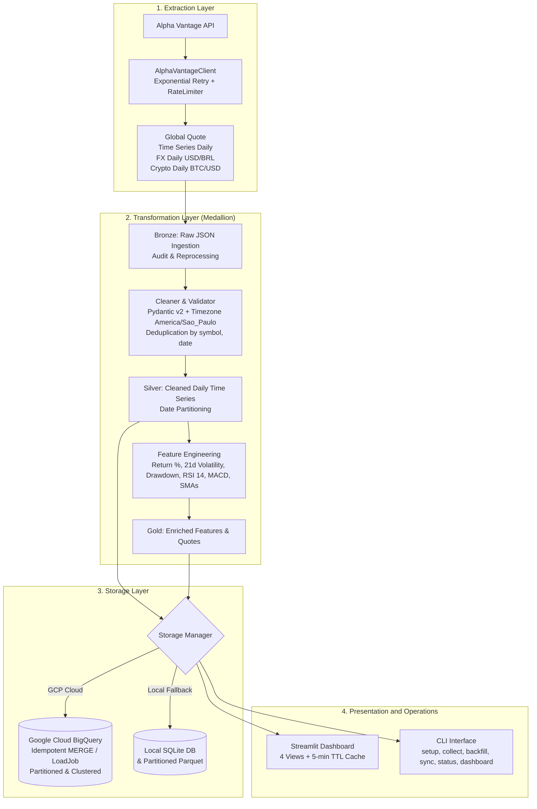

# Alpha Vantage Financial Market Pipeline and Analytics Dashboard

End-to-end financial data pipeline built in Python 3.12+, implementing the Medallion Architecture (Bronze, Silver, Gold). The pipeline extracts real-time quotes, daily time series, forex, and cryptocurrency data from the Alpha Vantage API, validates and computes derived quantitative features, persists data into Google Cloud BigQuery with local SQLite/Parquet fallback, and serves an interactive Streamlit analytics dashboard.

---

## 1. System Architecture



### Medallion Architecture:
- **Bronze (`bronze_quotes_raw`, `bronze_timeseries_raw`)**: Raw JSON payloads for auditability and replayability.
- **Silver (`silver_timeseries_daily`)**: Validated, typed, and deduplicated daily bars with normalized timestamps in `America/Sao_Paulo`.
- **Gold (`gold_daily_features`, `gold_latest_quotes`)**: Analytical dataset containing technical indicators (Daily Return %, 21d Annualized Volatility, 21d Average Volume, 252d Max Drawdown, SMA 7/21/50, RSI 14, MACD 12/26/9) and real-time quote snapshots.

---

## 2. Project Structure

```
Analise_Mercado_Alpha_Vantage/
├── app/
│   ├── __init__.py
│   ├── __main__.py              # Entrypoint for `python -m app`
│   ├── main.py                  # Module execution wrapper
│   ├── config.py                # Pydantic Settings and sensitive data masking filter
│   ├── cli.py                   # Command-line interface with Rich formatting
│   ├── schemas/
│   │   ├── __init__.py
│   │   ├── quote.py             # Pydantic v2 schema for market quotes
│   │   ├── timeseries.py        # Pydantic v2 schema for daily OHLCV bars
│   │   └── features.py          # Pydantic v2 schema for Gold features
│   ├── extract/
│   │   ├── __init__.py
│   │   ├── alpha_vantage_client.py  # HTTP client with retry and error handling
│   │   ├── endpoints.py         # Endpoint parameter builders
│   │   └── rate_limiter.py      # Rate limiting and daily quota tracking
│   ├── transform/
│   │   ├── __init__.py
│   │   ├── cleaner.py           # Timezone normalization and data cleaning
│   │   ├── validator.py         # Schema validation and report generation
│   │   └── features.py          # Vectorized indicators (RSI, MACD, volatility, drawdown)
│   ├── load/
│   │   ├── __init__.py
│   │   ├── bigquery_loader.py   # BigQuery batch loader and MERGE operations
│   │   ├── local_loader.py      # Local SQLite and Parquet persistence
│   │   ├── dataset_setup.py     # Schema DDL and table provisioning
│   │   └── storage_manager.py   # Unified storage abstraction layer
│   └── dashboard/
│       ├── __init__.py
│       ├── app.py               # Streamlit multi-view analytics application
│       ├── charts.py            # Plotly financial visualizations
│       └── queries.py           # Data access layer with `@st.cache_data`
├── tests/
│   ├── __init__.py
│   ├── conftest.py              # Global Pytest fixtures
│   ├── fixtures/                # Static API response payloads for offline testing
│   │   ├── global_quote.json
│   │   ├── time_series_daily.json
│   │   ├── fx_daily.json
│   │   ├── crypto_daily.json
│   │   └── technical_indicators.json
│   ├── test_client.py           # Tests for HTTP client, retries, and rate limits
│   ├── test_transform.py        # Tests for cleaning, validation, and feature calculations
│   ├── test_idempotency.py      # Tests for idempotent data writes
│   └── test_dashboard.py        # Tests for queries and chart generation
├── data/                        # Local storage directory (SQLite & Parquet)
├── .env.example                 # Environment variables template
├── .env                         # Active configuration
├── .gitignore                   # Credential and cache exclusions
├── requirements.txt             # Pinned project dependencies
├── Dockerfile                   # Container definition for Cloud Run deployment
├── pyproject.toml               # Build, Ruff, and Mypy configurations
├── pytest.ini                   # Pytest configuration
└── README.md                    # System documentation
```

---

## 3. Installation and Execution

### Prerequisites
- Python 3.12 or higher.
- Alpha Vantage API key (free or premium).
- Google Cloud project with BigQuery enabled (optional for cloud mode).

### Step 1: Virtual Environment Setup

```bash
cd Analise_Mercado_Alpha_Vantage

# Create virtual environment
python -m venv .venv

# Activate virtual environment
# Windows PowerShell:
.\.venv\Scripts\Activate.ps1
# Linux/macOS:
# source .venv/bin/activate

# Install dependencies
pip install -r requirements.txt
```

### Step 2: Environment Configuration

Copy the template configuration file:

```bash
cp .env.example .env
```

Default configuration in `.env`:
```ini
# Alpha Vantage API Key
ALPHA_VANTAGE_API_KEY=O2YI1934J9Z2QHQR

# Request throttle pause in seconds (5 req/min free tier threshold)
ALPHA_VANTAGE_RATE_LIMIT_PAUSE=12.0

# Safety threshold for daily requests (free tier = 25 req/day)
ALPHA_VANTAGE_DAILY_MAX_REQUESTS=25

# Storage Backend: 'auto', 'bigquery', or 'local'
STORAGE_MODE=auto
LOCAL_DATA_DIR=./data

# Google Cloud Platform (leave blank for local storage mode)
GCP_PROJECT_ID=api-project-805489364666
BIGQUERY_DATASET=market_data
BIGQUERY_LOCATION=US
GOOGLE_APPLICATION_CREDENTIALS=./service_account.json

# Timezone and Logging
DEFAULT_TIMEZONE=America/Sao_Paulo
LOG_LEVEL=INFO
```

---

## 4. CLI Commands (`python -m app`)

### 1. Initialize Storage Infrastructure (`setup`)
Provisions BigQuery dataset and partitioned tables, or initializes local SQLite/Parquet directories:
```bash
python -m app setup
```

### 2. Ingest Market Data (`collect`)
Fetches quotes and historical series, executes Medallion transformations, and stores data:
```bash
# Ingest all default assets (PETR4.SAO, VALE, AAPL, MSFT, USD/BRL, BTC)
python -m app collect --symbols all

# Ingest specific assets
python -m app collect --symbols "AAPL,PETR4.SAO,USD/BRL"

# Bypass safety budget check if using offline fixtures or premium key
python -m app collect --symbols "BTC" --force
```

### 3. Historical Backfill (`backfill`)
Fetches extended historical time series (`outputsize=full`):
```bash
python -m app backfill --days 365 --symbols "AAPL,PETR4.SAO"
```

### 4. Synchronize Local Data to BigQuery (`sync`)
Transfers existing local SQLite and Parquet records directly to BigQuery:
```bash
python -m app sync
```

### 5. Check System Status (`status`)
Displays Medallion row counts, active backend, monitored symbols, and remaining API quota:
```bash
python -m app status
```

### 6. Launch Analytics Dashboard (`dashboard`)
Starts the interactive Streamlit application:
```bash
python -m app dashboard
# Or directly:
streamlit run app/dashboard/app.py
```

---

## 5. Dashboard Features

The dashboard provides four analytical views:

1. **Market Overview**: Real-time quote cards (Price, Change %, Volume, Trade Date), consolidated asset summary table, and 30-day trend chart.
2. **Historical Analysis**: OHLCV Candlestick and Line charts with Simple Moving Averages (SMA 7, 21, 50) and synchronized volume bars.
3. **Technical Indicators & Risk**: RSI (14) with overbought/oversold levels, MACD (12, 26, 9) with signal line and histogram, 21-day rolling volatility, and 252-day maximum drawdown.
4. **Asset Comparison**: Normalized cumulative return percentage and Pearson correlation matrix heatmap.

---

## 6. Google Cloud Configuration (BigQuery)

1. **GCP Project Setup**: Create a GCP project (e.g., `api-project-805489364666`) and enable the BigQuery API.
2. **Service Account**: Create a Service Account with `roles/bigquery.admin` or `roles/bigquery.dataEditor` + `roles/bigquery.jobUser`.
3. **Service Account Key**: Download the JSON key file and place it at `./service_account.json`.
4. **Configure `.env`**:
   ```ini
   STORAGE_MODE=bigquery
   GCP_PROJECT_ID=api-project-805489364666
   BIGQUERY_DATASET=market_data
   BIGQUERY_LOCATION=US
   GOOGLE_APPLICATION_CREDENTIALS=./service_account.json
   ```
5. **Run Setup**:
   ```bash
   python -m app setup
   ```

---

## 7. Container Deployment and Google Cloud Run

```bash
# Build local container
docker build -t market-pipeline:latest .

# Run local container on port 8501
docker run -p 8501:8501 --env-file .env market-pipeline:latest

# Deploy to Google Cloud Run
gcloud run deploy market-dashboard \
    --source . \
    --project api-project-805489364666 \
    --region us-central1 \
    --allow-unauthenticated \
    --set-env-vars STORAGE_MODE=bigquery,GCP_PROJECT_ID=api-project-805489364666,BIGQUERY_DATASET=market_data,BIGQUERY_LOCATION=US
```

---

## 8. Automated Testing

```bash
# Run test suite
pytest -v

# Static analysis and linting
ruff check app tests

# Type validation
mypy app
```

---

## 9. Security and Operational Standards

- **Credential Isolation**: API keys and service account paths are managed through environment variables and excluded in `.gitignore`.
- **Sensitive Data Masking**: `SensitiveDataFilter` scrubs API keys and secret tokens from all logging handlers.
- **Quota Safety**: `RateLimiter` enforces inter-request throttle delays and daily request limits to prevent unexpected throttling or costs.
